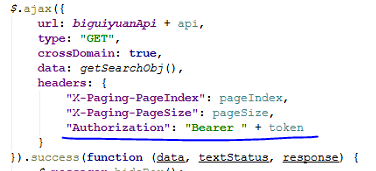
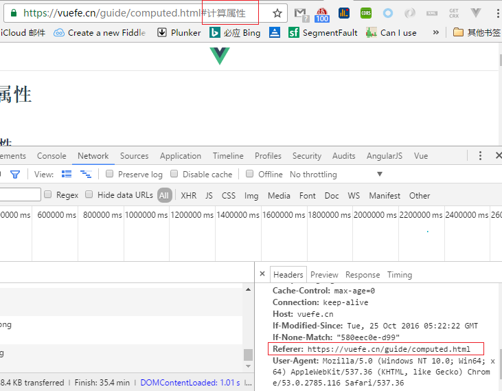

# 请求首部字段

####1. Authorization 
告知服务器，用户代理的认证信息（证书值）。

应用场景：需要传token信息，或者类似的认证信息（比如App H5页面使用的ak）

####2.If-Match(请求首部字段)
和ETag搭配使用，处理资源缓存。

只有If-Match和ETag值匹配**一致**时，服务器才会接受请求。

####3.If-None-Match
只有在If-None-Match和ETag值匹配**不一致**时，服务器才会接受请求。与If-Match首部字段作用相反。

####4.If-Modified-Since
该字段指定日期时间后，**资源发生了更新**，服务器会接受请求。

####4.If-Unmodified-Since
和If-Modified-Since作用相反。

该字段指定日期时间后，资源**未发生了更新**，服务器才处理请求。

####5.Referer
告知服务器请求的原始资源的URI。

    后端做重定向时可能需要这个信息。注意，它不会带上hash。
    

####6.User-Agent
会创建请求的浏览器和用户代理名称等信息传达给服务器。
