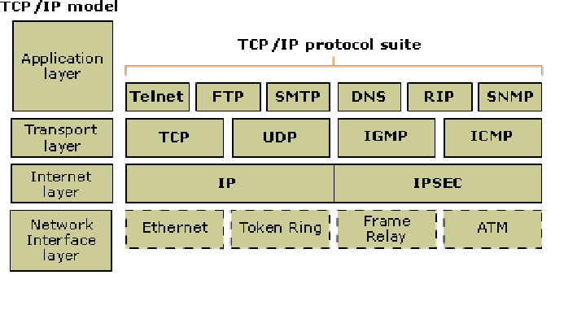
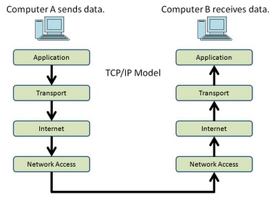
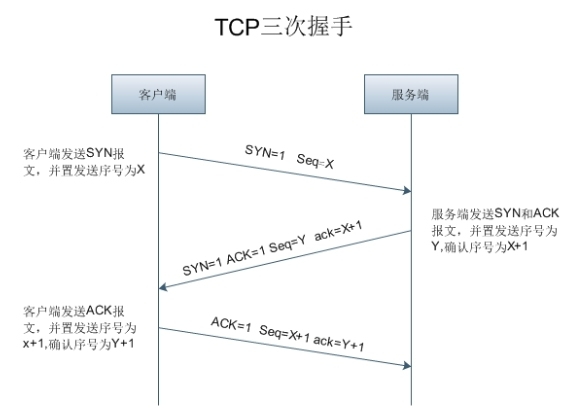

# TCP/IP

####HTTP协议发展
* HTTP 2.0将只用于https://网址,而 http://网址将继续使用HTTP/1
* HTTP1.1新加很多header头，如Expire;支持长连接:keep-alive;支持块编码传输

####TCP/IP协议

传输

####IP(Internet protocol)
IP地址指明了节点被分配到的地址，MAC地址指网卡所属的固定地址。IP间的通信依赖MAC地址。

####TCP
TCP协议为了更容易传达大数据会把数据分割，确保数据能够准确可靠的送达到对方。

TCP三次握手：

####DNS服务
根据域名查找IP地址