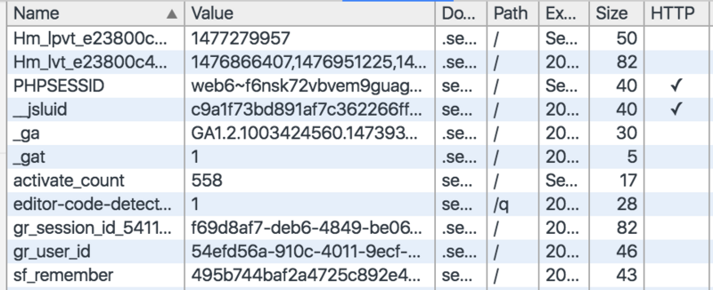

# Cookie

cookie的基本思想就是让浏览器积累一组服务器特有的信息，每次访问服务器时都将这些信息提供给它。

注意点：

1. **浏览器要负责存储cookie信息**
2. 浏览器只向服务器发送服务器产生的那些cookie
3. HTTP cookie与JS中document.cookies设置，有相似之处，也有不同之处。

###2种类型
默认是会话cookie。

* **会话 cookie**： 会话 cookie 存储在内存中，决不会写入磁盘。 当浏览器关闭时，cookie 将从此永久丢失。
* **持久性 cookie**： 在指定的到期日期，cookie 将从磁盘中删除。

###属性
#####1.Max-Age(有效期)

max-age属性值：

1. 正数：则表示该cookie会在max-age秒之后自动失效。浏览器会将max-age为正数的cookie持久化，即写到对应的cookie文件中。无论客户关闭了浏览器还是电脑，只要还在max-age秒之前，登录网站时该cookie仍然有效。

2. 负数：则表示该cookie仅在本浏览器窗口以及本窗口打开的子窗口内有效，关闭窗口后该cookie即失效。max-age为负数的Cookie，为临时性cookie，不会被持久化，不会被写到cookie文件中。cookie信息保存在浏览器内存中，因此关闭浏览器该cookie就消失了。cookie默认的max-age值为-1。

3. 0：则表示删除该cookie。cookie机制没有提供删除cookie的方法，因此通过设置该cookie即时失效实现删除cookie的效果。失效的Cookie会被浏览器从cookie文件或者内存中删除。
如果不设置expires或者max-age这个cookie默认是Session的，也就是关闭浏览器该cookie就消失了。

#####2.domain属性

**浏览器只向指定域中的服务器主机名发送cookie**。

这样服务器就将cookie限制在了特定的域中。

#####3.path属性

通过这个属性可以为服务器上的特定文档指定cookie。

如果没有设置path，就将其设置为生成set-cookie响应的url的路径。

#####4.secure属性
一个布尔值。

如果包含这个属性，就只有在HTTP使用SSL安全连接时才能发送cookie。

#####5.HttpOnly属性

HttpOnly 属性限制了 cookie 对 HTTP 请求的作用范围。特别的，该属性指示用户代理忽略那些通过“非 HTTP” 方式对 cookie 的访问（比如js的接口）。

注意 HttpOnly 属性和 Secure 属性相互独立：一个 cookie 既可以是 HttpOnly 的也可以有 Secure 属性。

| HttpOnly属性 | document.cookie是否能读取cookie | 浏览器读取cookie |
| -- | -- |-- |
| 设置 | 否 |是 |
| 不设置 | 是 | 是 |

