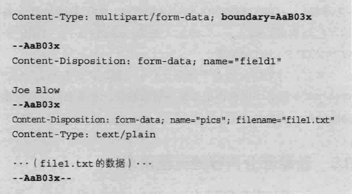
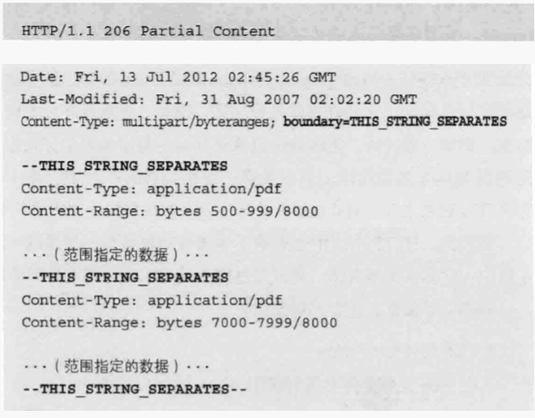

# 编码提升传输速率

HTTP在传输数据时可以按照原数据直接传输，但也可以在传输过程中通过编码提升传输速率。

####1.压缩传输内容编码

常用gzip

####2.分割发送的分块传输编码
在传输大容量数据时，通过把数据分割成多块，能够让浏览器逐步显示页面。

####3.发送多种数据的多部分对象集合
发送邮件时，我们可以在邮件里写入文字并添加多份附件。这是因为采用了**MIME（Multipurpose Internet Mail Extensions，多用途因特网邮件扩展）**机制，它允许邮件处理文本，图片，视频等多个不同类型的数据。

HTTP协议也采纳了多部分对象集合，发送的一份报文主体内可含有多类型实体（通常在图片或者文本文件等上传时使用）。多部分对象集合包含的对象如下：

* multipart/form-data：在web表单文件上传时使用。

* multipart/byteranges：状态码206（Partial Content，部分内容）响应报文包含了多个范围的内容时使用。

在HTTP报文中使用多部分对象集合时，需要在首部字段里加上Content-type。使用boundary字符串来划分多部分对象集合指明的各类实体。在boundary字符串指定的各个实体的起始行之前插入“--”标记（例如：--AaB03x，--THIS_STRING_SEPARATES），而在多部分对象集合对应的字符串的最后插入“--”标记（例如，--AaB03x--，--THIS_STRINGSEPARATES--）作为结束。

多部分对象集合的每个部分类型中，都可以含有首部字段。另外，可以在某个部分中嵌套使用多部分对象集合。