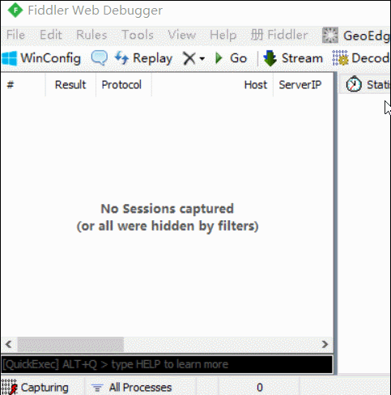
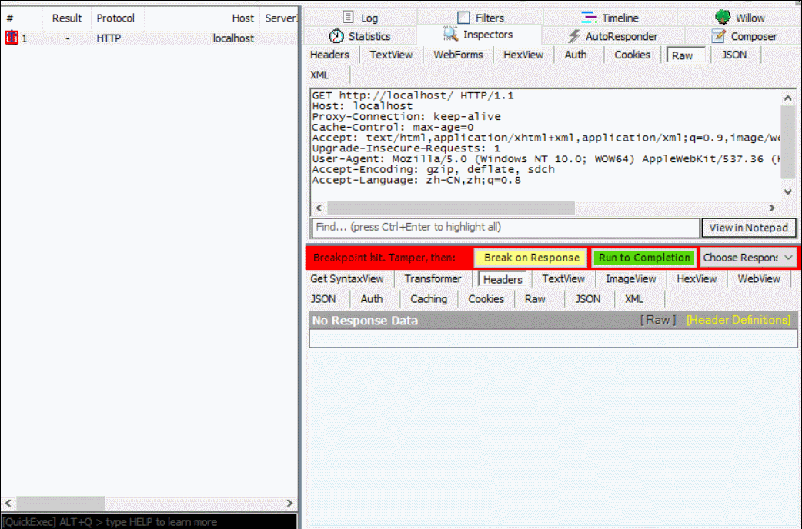

# 使用Fiddler


在Fiddler中我们可以通过```bpu XXX```指令来拦截指定请求，然后手动修改请求内容再发给服务器、修改响应内容再发给客户端。

example:

    <!DOCTYPE html>
    <html>
    <head>
    <title>缓存测试</title>
    <link rel="stylesheet" href="css/reset.css">
    </head>
    <body>
    <h1>哥只是一个标题</h1>
    <p></p>
    </body>
    </html>

以example为例，页面文件走nginx通过 http://localhost/ 可直接访问，所以我们直接执行“bpu localhost”拦截所有地址中带有该字样的请求：



点击被拦截的请求，可以在右栏直接修改报文内容**（上半区域是请求报文，下半区域是响应报文）**，点击黄色的“Break on Response”按钮可以执行下一步（把请求发给服务器），点击绿色的按钮“Run to Completion”可以直接完成整个请求过程：



通过这个方法我们可以很轻松地模拟出各种http缓存场景。