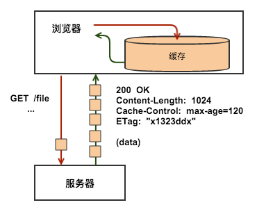
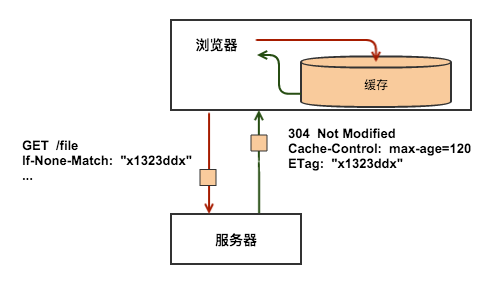

# 资源缓存

一般只需要关注**请求头If-None-Match、响应头ETag、响应头Cache-Control**就足够了。因为这三个Http头就可以满足你的需求，并且，当今绝大多数的浏览器，都支持这三个Http头。我们所要做的就是，确保每个服务器响应都提供正确的 HTTP 头指令，以指导浏览器何时可以缓存响应以及可以缓存多久。

#####缓存在哪儿？

上图中有三个角色，浏览器、Web代理和服务器，如图所示Http缓存存在于浏览器和Web代理中。当然在服务器内部，也存在着各种缓存，但这已经不是本文要讨论的Http缓存了。所谓的Http缓存控制，就是一种约定，通过设置不同的响应头Cache-Control来控制浏览器和Web代理对缓存的使用策略，通过设置请求头If-None-Match和响应头ETag，来对缓存的有效性进行验证。

#####响应头ETag

ETag全称Entity Tag，用来标识一个资源。在具体的实现中，ETag可以是资源的hash值，也可以是一个内部维护的版本号。但不管怎样，ETag应该能反映出资源内容的变化，这是Http缓存可以正常工作的基础。

如上例中所展示的，服务器在返回响应时，通常会在Http头中包含一些关于响应的元数据信息，其中，ETag就是其中一个，本例中返回了值为x1323ddx的ETag。当资源/file的内容发生变化时，服务器应当返回不同的ETag。

#####请求头If-None-Match

对于同一个资源，比如上一例中的/file，在进行了一次请求之后，浏览器就已经有了/file的一个版本的内容，和这个版本的ETag，当下次用户再需要这个资源，浏览器再次向服务器请求的时候，可以利用请求头If-None-Match来告诉服务器自己已经有个ETag为x1323ddx的/file，这样，如果服务器上的/file没有变化，也就是说服务器上的/file的ETag也是x1323ddx的话，服务器就不会再返回/file的内容，而是返回一个304的响应，告诉浏览器该资源没有变化，缓存有效。

如上例中所示，在使用了If-None-Match之后，服务器只需要很小的响应就可以达到相同的结果，从而优化了性能。

#####响应头Cache-Control

每个资源都可以通过Http头Cache-Control来定义自己的缓存策略，Cache-Control控制谁在什么条件下可以缓存响应以及可以缓存多久。 最快的请求是不必与服务器进行通信的请求：通过响应的本地副本，我们可以避免所有的网络延迟以及数据传输的数据成本。为此，HTTP 规范允许服务器返回一系列不同的 Cache-Control 指令，控制浏览器或者其他中继缓存如何缓存某个响应以及缓存多长时间。

Cache-Control 头在 HTTP/1.1 规范中定义，取代了之前用来定义响应缓存策略的头（例如 Expires）。当前的所有浏览器都支持 Cache-Control，因此，使用它就够了。

